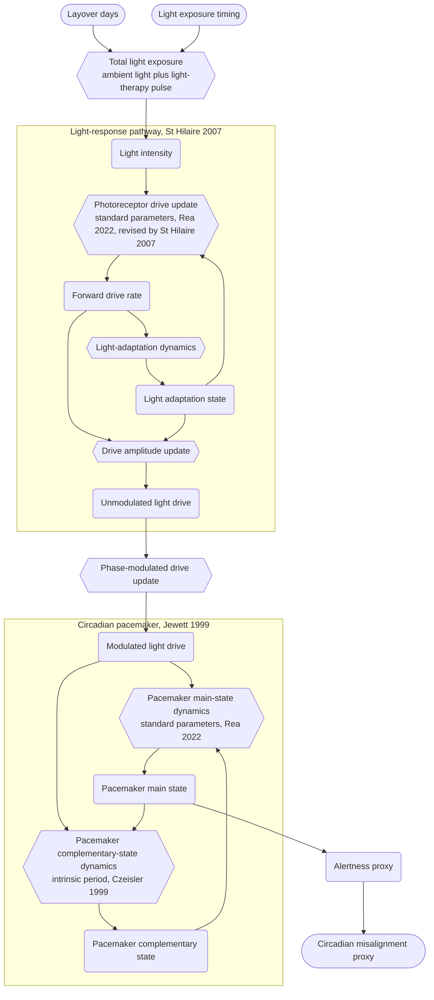

## Plan

- Source: this case is the S1 paper's currently active §6.3 case, replacing the earlier maternal-infant feeding case on 2026-08-23. That case's Pareto front degeneration had drawn user dissatisfaction and triggered an external literature verification pass across all cases, and on the same review both this case and §6.2 CKD were relabeled from "validation case" to "feasibility demonstration case." This case never went through a `models/plan/` stage; this file is a case-status record built after the fact, not migrated from an existing plan draft.
- Model files: `aircrew_circadian_sim.yaml`, with a companion joint-optimization scenario file `aircrew_circadian_opt.yaml`, in the same directory, neither ever moved.
- Decision conflict: the longer the layover, the lower the fatigue proxy circadian_misalignment_proxy on the day duty resumes on the return leg, but the more days the crew spends away, raising the operational-cost proxy trip_cost_days; the two objectives cannot be optimized to their best at the same layover length.
- Core mechanism: the Forger-Jewett-Kronauer, FJK, circadian pacemaker's third-order nonlinear ODE. Process P's equation structure, the x and xc limit-cycle oscillator, is taken from Jewett, Forger & Kronauer (1999); Process L's equation set, the light-driven chain, is taken from St Hilaire et al. (2007). The standard parameter set draws on two sources: mu, q, k, the light-response exponent, and I0 are transcribed from Table 2 of Rea et al. (2022), which compiles the calibrated version from Kronauer, Forger & Jewett (2000), while G, alpha0, and beta_n take the revised values given after eq.9 in St Hilaire et al. (2007); the intrinsic period tau_x=24.2 hours is independently taken from Czeisler et al. (1999). The eastbound-westbound asymmetry is not an external coefficient but a structural consequence of tau_x being slightly longer than 24 hours, which biases the x and xc equations.
- Pareto front: at full budget, population_size=100, n_generations=200, the search finds 100 non-dominated solutions, trip_cost_days spanning 3.00 to 6.99 days and circadian_misalignment_proxy spanning 1.000 to 0.583, a continuous front with no single-point degeneration.
- Independent verification: the directionality of the eastbound-westbound asymmetry matches the "westbound recovers more easily" direction reported in the clinical review by Sack (2010). The convergence of light-exposure timing near noon to early afternoon, 13.11 to 14.89, does not match the original prediction of an early-morning phase-advance window, but does match the clinical light-exposure advice for eastbound jet lag; this counts as an independent prediction check that was never fitted to the data, not an anomalous result.
- Confidence rating: moderately high. The main gap is that the fatigue proxy circadian_misalignment_proxy contains no homeostatic sleep-pressure mechanism at all, while validated fatigue models such as SAFTE-FAST attribute fatigue mainly to sleep debt, precisely the half of the mechanism this model lacks; this is the main reason this case is positioned as a feasibility demonstration rather than a tool that can directly support scheduling decisions.
- Model rating snapshot, 0 to 1, `docs/authoring/ratings.md`, taken from the model YAML's `metadata.ratings`:
  - Technical: variable 0.75, the FJK core parameters draw on two published sources, with mu/q/k/light-response exponent/I0 transcribed from the Rea 2022 calibrated version and alpha0/beta_n/G from St Hilaire 2007's own revised values, while light-therapy intensity and half-width are engineering calibrations; equation 1.0, the FJK third-order ODE is a widely cited standard form reproduced continuously since 1999; simulation 0.75; optimization 0.75, a full-budget search finds 100 non-dominated solutions with continuous coverage, and the contribution of the light-timing decision dimension grows substantially as layover days increase.
  - Non-technical: importance 0.75, innovation 0.5, since the FJK model itself is not original to this work and coupling it into K by 4 scheduling optimization is the incremental contribution, confidence 0.75.
- Citation tracing and manual verification status are recorded in `reference/aircrew.bib` in the same directory, openable in JabRef, with five custom fields, `locus`, `claim`, `reliance`, `attestation`, `provenance`, per the convention in `skill_agent/lm-citation-review.md`. Core-equation locators: process_p_x_dynamics and process_p_xc_dynamics correspond to eq.10 and eq.17; all four Process L equation locators have been verified line by line. The standard parameter set's kronauer2000 entry has a locally downloaded PDF whose filename does not match its actual content; it is in fact a different main paper by the same authors from 1999. Its existence has been cross-confirmed from two independent sources, but the PDF itself still needs to be re-downloaded, currently the only open citation issue.
- Optional follow-up directions, not currently required: couple homeostatic sleep pressure into alertness_proxy and test whether the current front still holds once this dominant mechanism is included; separately extract the pacemaker's phase angle, for example atan2(xc,x), and compare it against a target phase for a purer phase-alignment check than the current circadian_misalignment_proxy, to test the two-point diagnostic hypothesis for why the light-timing prediction failed.

## Archive

The full citation and mechanism traceability table is long and not repeated in the main text; it is kept here for reviewers checking each item against `aircrew.bib`.

Table 7. Mechanism traceability for the aircrew cross-time-zone scheduling model

| Index and description | Location in this paper | Location in the cited paper |
|---|---|---|
| $x$, $x_c$: pacemaker main-oscillator states, Process P limit-cycle oscillator | §6.3, equations `process_p_x_dynamics`, `process_p_xc_dynamics` | Jewett, Forger & Kronauer (1999), eq.10, eq.17 |
| $n$, $\alpha$, $\hat B$, $B$: light-driven chain states, Process L | §6.3, equations `process_l_n_dynamics`, `process_l_alpha_update`, `process_l_bhat_update`, `process_l_bdrive_update` | St Hilaire et al. (2007), eq.3, eq.9, eq.2, eq.6 |
| $\mu$, $q$, $k$, light-response exponent, $I_0$: standard parameter set | §6.3, parameter values in the pacemaker and light-drive equations | Rea et al. (2022), Table 2, transcribed from Kronauer, Forger & Jewett (2000) |
| $G$, $\alpha_0$, $\beta_n$: standard parameter set | §6.3, parameter values in the pacemaker and light-drive equations | St Hilaire et al. (2007), revised values given after eq.9 |
| $\tau_x$: intrinsic circadian period, 24.2 hours | §6.3, period term in equation `process_p_xc_dynamics` | Czeisler et al. (1999), abstract |
| $\kappa$: empirical correction constant on the period term | §6.3, equation `process_p_xc_dynamics` | Jewett, Forger & Kronauer (1999), eq.9 |

## Case text (fully synchronized with paper `c_paper_s1_cn.md` §6.3, 2026-09-01)

> This section fully mirrors paper §6.3 rather than summarizing it; `## Plan` and `## Archive` are unique to this file and are not part of the paper, maintained separately as this case progresses. Any future rewrite of paper §6.3 must be mirrored here, and vice versa.

### 6.3 Aircrew cross-time-zone scheduling: layover length versus on-duty fatigue

Section 6.2 tests whether two conflicting clinical guidelines within the same specialty can be jointly optimized into a genuine, non-degenerate front; this section switches to a discipline pairing with no shared literature base at all, testing whether front degeneration itself depends on modeling choices. Every time a long-haul international aircrew completes a round-trip cross-time-zone assignment, the airline's scheduling department must settle on a specific number of layover days, a figure currently set mostly by experience, without having quantified the relationship between layover length and the crew's actual circadian state. The second edition of the Fatigue Management Guide for Airline Operators, jointly published in 2015 by the International Air Transport Association, the International Civil Aviation Organization, and the International Federation of Air Line Pilots' Associations, already lists scheduling structure as a factor that can be actively adjusted within a fatigue risk management system, but it offers process guidance and expert judgment rather than a tool that jointly optimizes layover length against a mechanistic circadian model to produce a quantified trade-off curve directly.

A search across aviation medicine and biomathematical fatigue modeling on one side and crew-scheduling operations research on the other found each field mature on its own but no directly corresponding work at their intersection. The operations-research side does have a mature subfield embedding biomathematical fatigue quantities into scheduling objective functions; Yildiz, Gzara & Elhedhli (2017) used column generation to embed fatigue into the crew-pairing cost objective, but the fatigue quantity in such studies is a score or simplified count from a three-process alertness model, and the decision variables are combinatorial, pairing and roster assignment, with neither layover days nor light-exposure timing treated as continuous decision variables, nor the pacemaker equations themselves embedded. The closest work on the biomathematical side is Serkh & Forger (2014), published in PLOS Computational Biology, which uses the same circadian pacemaker model for optimal light control but covers only the resynchronization-time axis, with no cost axis. These two lines are each mature but do not intersect, so this case's specific joint Pareto front, layover length and light timing against operational cost and fatigue risk, has no directly published counterpart within the searched literature. Its magnitude broadly agrees with each line's own scale: Serkh and Forger report that an 8-hour phase advance under high-intensity light needs 3 to 4 days to resynchronize, and EU aviation safety regulation uses 3 consecutive local nights as the threshold for considering a crew adapted to a time zone; the shape and timescale of this case's 100 solutions, spanning 1 to 5 days, fall within this range. One finding treated as anomalous during drafting was that all light timing converged near noon rather than the predicted early morning; on review this is not anomalous but correct. On an 8-time-zone eastbound flight, morning light at the destination falls in the delay region of the body's internal phase, the opposite direction from the needed advance, and Sack's clinical jet-lag advice is precisely to avoid morning light and seek afternoon light during the first few days; this case's converged range of 13.11 to 14.89 falls right in that window. What was wrong was this case's original qualitative prediction, not the model itself. It is worth stating exactly what level this check confirms and what it does not: the model reproduces the directional judgment that morning light is unfavorable for eastbound jet lag, matching the clinical advice's direction; it does not reproduce the day-by-day shifting light-control strategy that is itself the optimal solution in Serkh & Forger (2014), since this case fixes light timing to a single time of day across the whole layover and is structurally unable to express day-by-day adjustment, so the two checks are not at the same level, see the residual inconsistency noted next and the limitations section below. One residual inconsistency remains: in the numerical results, the fatigue proxy at 08:00 saturates at 1.0, and at 18:00 it still reaches 0.989 despite some relief, while the clinical window considers the afternoon still favorable overall, and this fixed-single-time-of-day structural simplification is a plausible cause. Taken together, this case's confidence rating is set at moderately high.

Laying out the trade-off that crew-scheduling departments actually face, a longer layover lowers the fatigue proxy on the day duty resumes on the return leg, but the more days the crew spends away, the higher the operational cost from hotel, per-diem, and aircraft turnaround, so the two objectives cannot both reach their best at the same layover length. Crossing the same number of time zones, eastbound travel is typically harder to recover from than westbound, a phenomenon already reported in the clinical review literature and a further asymmetry layered on top of this trade-off; the model discussed here re-derives this asymmetry as an emergent result of the equations themselves rather than an extra directional coefficient added on, with the mechanism described below.

Turning this trade-off into an explicit joint optimization problem, the goal is to simultaneously minimize trip_cost_days, the crew's total days away, a proxy for operational cost and aircraft turnaround efficiency, and circadian_misalignment_proxy, the fatigue proxy for the first duty day after return, a proxy for the safety-side objective. Both decision variables are searched under an eastbound scenario, with the time-zone offset fixed at 8 hours, the direction where the return leg is harder to recover from and the operational-safety tension is sharpest; layover length is bounded to 1 to 5 days and light-exposure timing to 4 to 22 local-clock hours, both ranges confirmed during diagnostic scanning to carry a real gradient without overall saturation. The model couples the Forger-Jewett-Kronauer pacemaker model, abbreviated FJK, with the following independently calibrated dynamics:

- The pacemaker's main oscillator, Process P: states $x$ and $x_c$ form a limit-cycle oscillator, with the equation structure taken directly from the revised version by Jewett, Forger & Kronauer in 1999.
- The light-driven chain, Process L: light intensity is converted through three steps, $\alpha$, $\hat B$, $B$, into the drive entering the pacemaker, with the equation set taken directly from the work of St Hilaire and colleagues in 2007.
- The standard parameter set draws on two sources: $\mu$, $q$, $k$, the light-response exponent, and the light-normalization reference value are transcribed from Table 2 of Rea and colleagues in 2022, which compiles the calibrated version from Kronauer, Forger & Jewett in 2000; $G$, $\alpha_0$, and $\beta_n$ take the revised values given after eq.9 by St Hilaire and colleagues in 2007, sharing that paper's Process L equation structure.
- The intrinsic period $\tau_x$ is set to 24.2 hours, the healthy adult population average, independently taken from measurements by Czeisler and colleagues in 1999, consistent in magnitude with the preceding parameter table.

This model's coverage differs from `sleep_schedule.yaml` in the same discipline lineage: that model covers the homeostatic sleep pressure and bedtime timing of the Borbély two-process model, answering how long and when to sleep within a single time zone; this model does not model homeostatic sleep pressure at all, covering only the circadian pacemaker's phase dynamics, answering the separate question of how long phase realignment takes after crossing time zones. The two models' mechanism coverage is complementary and does not overlap. The runnable model file for this section is `aircrew_circadian_sim.yaml`, with joint optimization in `aircrew_circadian_opt.yaml`.

Light passes through Process L's three steps in series to produce the modulated light drive B, which then enters Process P; x and xc feed into each other, forming the classic limit-cycle feedback loop rather than a one-way chain. The standard parameter set and the intrinsic period are a second, independent category of citation supplying only numerical calibration, and they do not change the topology shown above.

The two decision variables are the layover length $L$ and the light-exposure timing $H$, the latter being the destination local-clock center hour each day during the layover at which the crew actively seeks high-intensity light. The simulation clock itself is defined as destination local time, with $t=0$ at the moment of arrival at the destination, and the return departure time, when the layover ends, falls at $1440L$ minutes, after which the local-clock reference switches to origin local time. Equation `local_clock_update` gives

$$C(t) = \begin{cases} (t/60) \bmod 24 & t < 1440L \\ ((t/60) - \tau) \bmod 24 & t \ge 1440L \end{cases}$$

where $\tau$ is the time-zone offset crossed, positive eastbound. This switch itself carries no directional assumption; the sole source of asymmetry is the structural bias toward phase delay that $\tau_x$, slightly longer than 24 hours, produces under free-running conditions in the $x$, $x_c$ equations. This delay direction matches the adjustment needed westbound and opposes the adjustment needed eastbound, which is exactly the mechanism by which the model re-derives eastbound travel as harder to recover from rather than adding an external coefficient for it.

The equation where $L$ and $H$ appear together is `total_light_update`, giving the total light intensity

$$I(t) = I_{amb}(t) + I_p \cdot \mathbb{1}\!\left[t<1440L \ \text{and}\ \left|\big((t/60 \bmod 24) - H + 12\big)\bmod 24 - 12\right| \le w\right]$$

where $I_p$ is the active light-therapy pulse intensity and $w$ is the pulse half-width, set to 1 hour. This indicator function shows that $L$ controls how many days the light-therapy pulse remains in effect while $H$ controls where in the 24-hour day the pulse falls. The light signal then propagates down the Process L chain,

$$\alpha(t) = \alpha_0 \left(\frac{I(t)}{I_0}\right)^{0.5} \cdot \frac{I(t)}{I(t)+100}, \qquad \hat B(t) = g\,(1-n(t))\,\alpha(t), \qquad B(t) = \hat B(t)\,(1-0.4x(t))(1-0.4x_c(t))$$

Taking the partial derivative with respect to $\hat B$, $\frac{\partial B(t)}{\partial \hat B(t)} = (1-0.4x(t))(1-0.4x_c(t))$, a state-dependent gain factor, so a light pulse of the same intensity has a different actual effect on the drive $B$ depending on which phase of the pacemaker it falls on. Using the amplitude range measured during diagnostic testing, $x\in[-1.14,1.07]$, $x_c\in[-1.32,1.04]$, this gain factor is estimated to range roughly from 0.49 to 1.89, a span of about 3.9-fold; a light pulse falling near the pacemaker's positive amplitude peak produces the weakest amplification of $B$, and one falling near the negative trough produces the strongest. $B(t)$ in turn drives the pacemaker's main equations, `process_p_x_dynamics` and `process_p_xc_dynamics`, giving

$$x(t+\Delta t) = x(t) + \Delta t\,\omega\Big(x_c(t) + \mu\big(\tfrac{x(t)}{3}+\tfrac{4}{3}x(t)^3-\tfrac{256}{105}x(t)^7\big) + B(t)\Big)$$

$$x_c(t+\Delta t) = x_c(t) + \Delta t\,\omega\Big(q\,B(t)\,x_c(t) - x(t)\big((\tfrac{24}{\kappa\tau_x})^2 + k\,B(t)\big)\Big)$$

The term $\mu(x/3+\tfrac{4}{3}x^3-\tfrac{256}{105}x^7)$ is the classic limit-cycle damping structure, supplying negative damping to trajectories with smaller amplitude and positive damping to those with larger amplitude, so the system converges to a fixed-amplitude limit cycle regardless of its initial condition. This model's initial values, $x=1.0$, $x_c=0.0$, are not the exactly solved limit-cycle fixed point, so the multi-day simulation carries a transient lasting on the order of several days, and the longer the layover, the more time the pacemaker has to converge from that initial transient toward the true limit cycle before the return-flight switch occurs. This convergence process itself has diminishing returns: the closer the trajectory gets to the limit cycle, the smaller the amplitude improvement the same additional time delivers. The effect of layover length on the post-return fatigue proxy should therefore fall monotonically as $L$ increases, with the rate of decline diminishing, since once near the limit cycle, further extending the layover yields ever-smaller marginal improvement. The joint front between the cost and fatigue axes can therefore be expected to form a continuous, monotonic curve of diminishing marginal benefit rather than degenerating to a single point.

Equation `trip_cost_update` gives $T(L) = L + T_0$, with $T_0=2$ the fixed number of days consumed by the outbound and return legs; $\frac{\partial T}{\partial L}=1$ always, and $\frac{\partial T}{\partial H}=0$ always, so $T$ is an exact linear function of $L$ and entirely independent of light timing.

An eastbound assignment requires the pacemaker to complete a phase advance to realign with the origin time zone, and the FJK model's intrinsic nonlinear light-response structure implies a window of light timing favorable to phase advance, generally understood to be closer to the crew's local early morning. Combined with the state-dependent gain factor derived above, moving $H$ from noon toward early morning would place the light pulse more often on a phase where the pacemaker's amplitude deviates from its peak and the gain factor is larger, producing a stronger drive perturbation. So it can be expected that moving $H$ from the search midpoint at noon toward the early-morning region should lower the post-return fatigue proxy, and the optimal $H$ found by the joint search should lean toward the lower end of the search range, near early morning, rather than clustering at noon.

Results are reported along two separate paths, search and diagnostic scanning. The diagnostic stage first fixes light timing at noon, 12:00, and scans layover length; the results are in Table 8.

Table 8. Diagnostic scan of layover length, eastbound time-zone offset of +8 hours, light timing fixed at noon 12:00

| Layover days | circadian_misalignment_proxy |
|---|---|
| 1.0 | 1.000 |
| 2.0 | 0.999 |
| 2.5 | 0.940 |
| 2.6 | 0.961 |
| 2.8 | 0.961 |
| 3.0 | 0.951 |
| 4.0 | 0.872 |

The 1.0 to 2.0 day range sits near the saturation ceiling of 1.0, and the overall trend declines after 2.0 days, but the 2.5 to 3.0 day range is not strictly monotonic: 2.5 days falls to 0.940, 2.6 to 2.8 days rebounds to 0.961, and 3.0 days falls again to 0.951. This same set of values was rechecked at a 5-minute step, and the fluctuation persists, so it is not a discretization artifact of a coarse simulation step. The model's own limitations section already notes that circadian_misalignment_proxy is driven by both phase alignment and instantaneous pacemaker amplitude, which become entangled before the pacemaker has fully converged to the limit cycle, consistent with this local fluctuation.

The diagnostic stage next fixes the layover at 3.0 days and scans light timing; the results are in Table 9.

Table 9. Diagnostic scan of light timing, eastbound time-zone offset of +8 hours, layover fixed at 3.0 days

| Light timing | circadian_misalignment_proxy |
|---|---|
| Early morning 08:00 | 1.000 |
| Noon 12:00 | 0.951 |
| Evening 18:00 | 0.989 |

The directionality of the eastbound-westbound asymmetry is verified separately by fixing the layover at 1.5 days and switching only the time-zone offset direction; the results are in Table 10.

Table 10. Eastbound-westbound asymmetry comparison, layover fixed at 1.5 days, light timing fixed at noon 12:00

| Direction | Time-zone offset | circadian_misalignment_proxy |
|---|---|---|
| Westbound | -8 hours | 0.878 |
| Eastbound | +8 hours | 1.000 |

The joint optimization searches with NSGA-II over layover length from 1 to 5 days and light-exposure timing from 4 to 22 local-clock hours, with a population of 100 and 200 generations, finding 100 non-dominated solutions, all mutually non-dominated, forming a continuous front with no single-point degeneration and all 99 adjacent pairs strictly non-increasing. trip_cost_days = layover_days + 2.0 holds exactly; the cost range is 3.00 to 6.99 days, the fatigue range is 0.583 to 1.000, and all light timing converges to 13.11 to 14.89, hugging noon to early afternoon rather than the predicted early-morning region. Table 11 lists 5 representative points spanning the full range of the front.

Table 11. Representative points on the joint optimization front

| Layover days | Light timing | trip_cost_days | circadian_misalignment_proxy |
|---|---|---|---|
| 1.00 | 13.11 | 3.00 | 1.000 |
| 2.21 | 13.54 | 4.21 | 0.903 |
| 3.21 | 14.20 | 5.21 | 0.785 |
| 4.14 | 14.36 | 6.14 | 0.683 |
| 4.99 | 14.40 | 6.99 | 0.583 |

trip_cost_days runs from 3.00 to 6.99 days, a span of about 4 days, and circadian_misalignment_proxy falls from 1.000 to 0.583, a span of about 0.42. Light timing across all 100 solutions falls between 13.11 and 14.89 local-clock hours, hugging noon to early afternoon and staying far from the search bounds of 4.0 and 22.0.

Comparing against non-LM practice makes the joint optimization's contribution concrete. The EU aviation safety regulation and the IATA/ICAO/IFALPA fatigue management guide mentioned earlier both use 3 consecutive local nights as the threshold, and fixing the layover at 3 days with light timing left at an unconsidered default of noon 12:00, with no structured light intervention, represents the point current scheduling practice lands on without this method, corresponding to the eastbound_mid_layover scenario in `aircrew_circadian_sim.yaml`. Table 12 places this non-LM baseline alongside the solution on the joint optimization front with the closest operational cost.

Table 12. Non-LM baseline versus LM joint optimization, a pair of solutions with similar operational cost

| Scenario | Layover days | Light timing | trip_cost_days | circadian_misalignment_proxy |
|---|---|---|---|---|
| Non-LM baseline, 3-day threshold, light not optimized | 3.00 | 12.00 | 5.00 | 0.951 |
| LM joint optimization, closest-cost solution on the front | 3.11 | 14.03 | 5.11 | 0.856 |

At almost the same operational cost, joint optimization lowers the fatigue proxy from 0.951 to 0.856, an improvement of about 0.095. The layover length differs by only 0.11 days, not enough on its own to explain this gap. Isolating light timing's contribution at a fixed layover of 3.11 days, noon 12:00 gives 0.912 and the front's converged value of 14.03 gives 0.856, so light timing alone contributes about 0.056, roughly 60 percent of the total improvement. Repeating this same isolation test at fixed layovers of 1.0, 2.0, 4.0, and 5.0 days gives light timing's independent contribution as 0, 0.009, 0.136, and 0.199 respectively, growing substantially as the layover lengthens; all four test points avoid the 2.5 to 3.0 day local-fluctuation zone found in the diagnostic scan in Table 8, so light timing is a second decision dimension with substantial contribution in longer-layover scenarios, converging toward afternoon rather than early morning.

Figure 4. Six panels of aircrew cross-time-zone scheduling sim trajectories and joint optimization results. Panels (a) and (b) are taken from `--sim` output on `aircrew_circadian_sim.yaml`, using four plans already defined in that file's `simulation.plans`. Panels (c) through (f) are taken from `optimizer.results.pareto_front` in `aircrew_circadian_opt.yaml`, 100 non-dominated solutions, and from the diagnostic scans in Tables 8 through 10, all plotted with Python and matplotlib. (a) alertness_proxy against simulated time, eastbound, light timing fixed at noon, comparing 1.5-day, 3-day, and 4-day layovers, with a vertical line marking each plan's own return-flight moment. (b) alertness_proxy against simulated time, eastbound, layover fixed at 3 days, comparing light timing at noon against light timing at 08:00, with the shaded band marking the 24-hour post-return diagnostic window. (c) The joint optimization front, horizontal axis trip_cost_days, vertical axis circadian_misalignment_proxy, light blue for all 100 non-dominated solutions and orange for the 5 representative points from Table 11, each labeled with its layover length. (d) The layover-length diagnostic scan, corresponding to Table 8. (e) The light-timing diagnostic scan, corresponding to Table 9, with the front's convergence near noon matching the curve's trough. (f) The eastbound-westbound asymmetry comparison, corresponding to Table 10.

Panels (a) and (b) share the color encoding given in their own legends; panels (c) through (f) share the color encoding described next. In panel c, the 100 light-blue dots are all the non-dominated solutions from the joint optimization, the 5 large orange dots are the representative points listed in Table 11, and the green diamond is the single non-LM baseline point, representing a schedule that keeps the industry's current 3-day threshold with light timing left unoptimized. The horizontal axis is the crew's total days away, a proxy for operational cost, and the vertical axis is the post-return fatigue proxy, with lower values meaning less fatigue. These points connect from upper left to lower right into a downward-curving line: shorter layovers with lower cost have a higher fatigue proxy, and longer layovers with higher cost have a lower one. The green diamond sits above and to the right of this curve, and the light-blue points at similar cost sit below it, meaning the same operational cost can buy a lower fatigue proxy. Panel d is a blue line, horizontal axis layover days and vertical axis again the fatigue proxy, corresponding to the diagnostic scan in Table 8 with light timing fixed at noon. Panel e is a red line, with light timing on the horizontal axis instead and the vertical axis unchanged, corresponding to the diagnostic scan in Table 9 with the layover fixed at 3 days. Panel f is a bar chart, green for westbound and red for eastbound, with the vertical axis still the fatigue proxy; the difference in bar height directly shows the eastbound-westbound asymmetry, the red bar clearly higher than the green.

Without LM, an airline's scheduling department can only set the layover at the industry's common 3-day threshold by experience, leaving light timing entirely unarranged and defaulting near noon, corresponding to the green diamond in panel a, with a fatigue proxy of 0.951. At almost the same operational cost, joint optimization finds a plan that lowers the fatigue proxy to 0.856, giving the crew a light-timing knob that was previously left out of the decision entirely; moving it from the default noon to around 14:00 alone contributes roughly 60 percent of this improvement, with fine-tuning the layover length contributing the rest, and the diagnostic scans in panels b and c show this knob's value growing as the layover lengthens.

Checking the three predictions derived above from the equations, the first matches exactly: every solution on the front satisfies trip_cost_days equal to layover days plus 2.0, Table 10 holds row by row, and light timing has no discernible effect on cost. The second matches in direction but with a gap in magnitude: circadian_misalignment_proxy generally falls as layover length increases but not strictly monotonically, with Table 8 showing the 1.0 to 2.0 day range already near the saturation ceiling of 1.0 and a small local rebound between 2.5 and 3.0 days, not fully matching the expectation of monotonic improvement from the very start of the layover. The third finds no directional support at all: all 100 solutions converge light timing near noon to early afternoon, none falling in the predicted early-morning phase-advance region, and the diagnostic scan in Table 9 independently confirms the same direction, with early morning 08:00 clearly worse than noon and evening 18:00 also worse than noon though by a smaller margin. Yet in magnitude, light timing is far from negligible; the isolation test following Table 12 shows its contribution growing substantially as the layover lengthens. The directional prediction failed and the magnitude prediction also failed, and both are recorded as found rather than smoothed over by revising the derivation above. Figure 4 panels (a) and (b), the sim trajectory panels, show this dynamics directly. Panel (a) shows alertness_proxy completing the pacemaker's own convergence toward the limit cycle during the layover; the 1.5-day, 3-day, and 4-day return lines fall respectively near the rising edge, the falling edge, and the trough of that oscillation, meaning the phase at which the return moment lands moves nonlinearly with layover length. The finer-grained local rebound Table 8 finds when scanning the same range at closer day intervals is consistent in direction with this nonlinear phase drift, not a discretization artifact. Panel (b) compares light at noon against light at 08:00 under a fixed 3-day layover; the two curves nearly coincide for almost the entire simulation, diverging only at the trough within the 24-hour post-return window, where the amplitude differs by about 0.05, the 08:00 plan bottoming out exactly at 0 and the noon plan stopping around 0.05. This small amplitude gap is precisely what the 1.000 versus 0.951 circadian_misalignment_proxy values in Table 9 come from, and it also shows directly why an effect of this magnitude is easy for a directional prediction to miss. The model file itself raises two points for further discussion. First, circadian_misalignment_proxy is the running minimum of alertness_proxy within the 24-hour post-return window, a quantity driven by both phase alignment and instantaneous pacemaker amplitude that cannot be separated on this proxy; a light pulse falling in the afternoon rather than the predicted morning can still deliver a real improvement, possibly through the state-dependent gain factor derived earlier suppressing instantaneous amplitude rather than through improving phase alignment itself, a conjecture not yet verified by separately extracting the pacemaker's phase angle. Second, light timing is fixed to a single time of day across the whole layover and does not adjust with the day-by-day actual phase shift, unlike the day-by-day adjustment strategy that real phase-response protocols call for, and whether this structural limitation masks a better day-by-day light schedule than the current convergence point remains an open question.

Returning to the original trade-off, the actual computed answer is not a one-time binary choice but a specific point on a continuous curve. As the layover extends from a minimum of 1 day to a maximum of 5 days, the operational-cost proxy rises from 3 to 7 days and the on-duty fatigue proxy falls from 1.000 to 0.583, and the crew-scheduling department picks a point along this curve according to how much it currently weighs cost against safety; a layover just over 3 days, for example, corresponds to an operational cost around 5 days and a fatigue proxy down near 0.86, a compromise position in the curve's middle stretch. Compared with the industry's current practice of a fixed 3-day threshold with light timing left unoptimized, joint optimization lowers the fatigue proxy from 0.951 to 0.856 at almost the same operational cost, an improvement of about a tenth, of which moving light timing from the default noon 12:00 to around 14:00 alone contributes roughly 60 percent. Within the range this model gives, the crew now has more than one lever to trade cost against safety; light timing, this second knob, carries real value in longer-layover scenarios, though that value varies with layover length and is not pronounced when the layover itself is already short.

Limitations: the discrepancy in units between the global step_size and each equation's own units has already been manually converted to minutes; any other model that uses t or time directly in cross-day or cross-hour comparisons may be subject to the same discrepancy. The time constant of the photoreceptor state $n$ is close to the simulation step, so Euler discretization may not fully resolve this fastest dynamic. The two-point diagnosis for why the light-timing prediction failed has not yet been verified by separately extracting the pacemaker's phase angle, and remains only a plausible explanation. A set of values, including the mapping coefficients in alertness_proxy, ambient light magnitudes, and light-therapy pulse parameters, are engineering calibrations rather than direct literature measurements. The model does not cover the outbound leg's time-zone transition, homeostatic sleep pressure, or sleep-debt accumulation across multiple flight segments. The genuinely open gap is that the fatigue proxy contains no homeostatic sleep debt, the main reason this case is positioned as a feasibility demonstration rather than a tool that can directly support scheduling decisions; incorporating this dominant mechanism is left to collaborators in aviation medicine and fatigue risk management.
