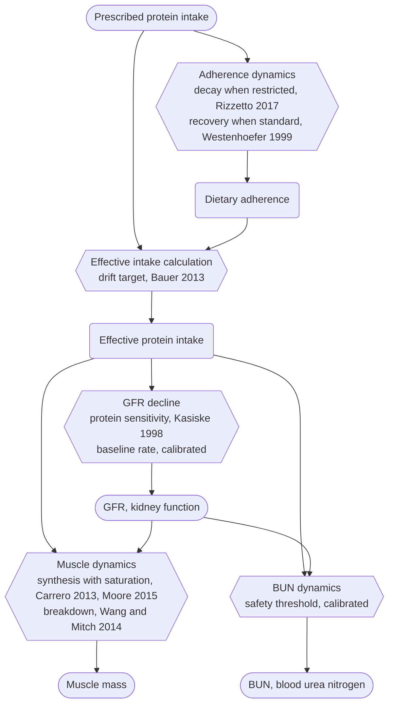

## Plan

- Source: this case is the S1 paper's currently active §6.2 case, originally called the validation case; on 2026-08-23 three limitations, the lack of a synthesis saturation mechanism, the missing mortality endpoint, and the single-point extrapolation used for the adherence-decay rate, undermined that "validation" label, and it was relabeled a feasibility demonstration case rather than an unevaluated candidate from the candidate overview table. On 2026-08-20 a chain of reviews triggered by the user's dissatisfaction with the maternal-infant case's Pareto degeneration also applied the same external literature verification pass to this case, previously done only for four new candidates; the maternal-infant case was later replaced by the aircrew cross-time-zone scheduling case as §6.3.
- Model files: `ckd_protein_sim.yaml`, with three optimization scenario files, `ckd_protein_opt_renal.yaml`, `ckd_protein_opt_muscle.yaml`, and `ckd_protein_opt_joint.yaml`, in the same directory, none moved. The verification concluded the case is fixable and does not need to be rebuilt, and it is not being removed from S1.
- Decision conflict: KDIGO 2020, protein restriction of 0.6-0.8 g/kg for stages G3a-G3b, evidence grade 2C, versus the PROT-AGE consensus, ≥1.0 g/kg/day for sarcopenic or older patients; the two recommended ranges do not overlap.
- Pareto front: joint optimization finds 9 non-dominated solutions, reconfirmed on 2026-09-02 using the archived results, since the previously recorded 12 solutions at 41.75-43.02/24.19-27.87 turned out to be an old result not reproducible under the same seed and budget, see the metadata.log in `ckd_protein_opt_joint.yaml`; GFR spans 42.45-43.13 mL/min/1.73m² and muscle mass spans 25.89-27.61 kg, a moderate but genuinely non-degenerate range.
- External literature verification summary:
  - Whether comparable studies exist: no directly corresponding literature performs joint quantitative optimization of this kind. Four categories of adjacent literature were found, a Nutrients 2021 staging-threshold paper, cost-effectiveness Markov models in Mennini 2014 and NDT 2025, Piccoli's stepwise graded prescription, and a JPM 2022 review, none of which qualify as comparable studies; the first group gives only staging thresholds with no trade-off curve, and the cost-effectiveness models use a single QALY objective with no muscle-mass endpoint.
  - Consistency: the GFR-side magnitude holds up, with the model's slope about 1.4 to 2 times steeper than the MDRD secondary analysis but still within the literature's reported spread, noting that the MDRD main result was itself negative and the KDIGO evidence grade is only 2C. The muscle side previously showed a genuine conflict, the joint front pushing muscle mass up to 28.88 kg, above the model's initial value of 28.0 kg, meaning a net muscle gain over a year from diet alone with no resistance exercise, at odds with the BMC Geriatrics (2025) meta-analysis finding no significant effect of protein supplementation on lean mass in older adults without accompanying resistance exercise. This has been corrected by adding a per-meal protein-synthesis saturation point of 0.40 ± 0.19 g/kg body weight, calibrated from Moore et al. (2015), to the synthesis term in `muscle_dynamics`, and after reconvergence the model no longer gains muscle without an upper bound; adding a ceiling is still not the same as a resistance-training gating mechanism itself, and this finer mechanism gap remains unaddressed.
  - Uncaptured structural features: the model does not include a mortality endpoint. Multiple cohort studies, Seniors-ENRICA and SNAC-K, 8539 older adults combined, report lower all-cause mortality with higher protein intake in CKD patients, HR 0.75-0.90, while long-term MDRD follow-up shows a mortality HR of 1.92 in the very-low-protein group; including a mortality endpoint could rewrite both the shape of the joint optimization front and the current "moderate trade-off" conclusion.
  - Likely reasons no comparable study exists: there is a lack of cohorts that both randomize protein amount and longitudinally track GFR trajectory alongside body-composition change together; creatinine-based eGFR is itself confounded by muscle mass, about 5.9 mL/min per 10 kg of lean mass, coupling the two endpoints at the measurement level itself, which is why later MDRD work switched to iothalamate clearance to avoid this issue; funding has concentrated on cost-effectiveness research aimed at delaying dialysis; recent reviews suggest modern pharmacotherapy has weakened the research motivation for optimizing the dietary dimension itself; and the timing of switching from a restricted to a standard diet has only ever been discussed qualitatively in the existing literature, never quantified.
  - Confidence rating: moderately high. After being judged on 2026-08-20 as "not yet fully satisfactory on objective grounds," three fixes have been applied: the paper and the model file were both updated with limitations, the lack of a synthesis saturation or resistance-training gating mechanism, the missing mortality endpoint, and the reinterpretation of Rizzetto et al. 2017's single adherence data point as a continuous decay-curve anchor being an extrapolation; the CKD staging description was corrected, from the inaccurate "G3b to G4" to the accurate "G3a to G3b," with the model's actual GFR trajectory values added; and on 2026-08-23 a synthesis saturation ceiling was added to `muscle_dynamics`, fixing the unbounded net-muscle-gain issue on the muscle side. The verdict itself stands, only narrowed in scope to the GFR and muscle-mass endpoints, and `confidence` was raised slightly from 0.5 to 0.55.
- Model rating snapshot, 0-1, `docs/authoring/ratings.md`, taken directly from the model YAML:
  - Technical: variable 0.75, equation 0.75, simulation 0.6, after adding the saturation ceiling on 2026-08-23 the muscle side no longer conflicts in direction with the literature, though the resistance-training gating mechanism is still not incorporated and a full independent data comparison has not been performed, optimization 0.75
  - Non-technical: importance 1.0, the paper's flagship core case, relied on by multiple scenarios in the A4 series, innovation 0.75, confidence 0.55
- Optional follow-up directions, not currently required: add a resistance-training gating term to `muscle_dynamics`, an independent mechanism variable governing whether synthesis rate requires exercise training to be realized beyond protein intake alone; or add a mortality-risk endpoint as a third joint optimization objective and re-evaluate whether the front still shows a "moderate trade-off."
- Citation tracing and manual verification status are recorded in `reference/ckd.bib` in the same directory, openable in JabRef, with five custom fields, `locus`, `claim`, `reliance`, `attestation`, `provenance`, per the convention in `skill_agent/lm-citation-review.md`; this file does not duplicate the reference list or open citation issues here. On 2026-09-01 the qualitative support citation for adherence recovery was changed from De Mauri et al. (2022) to Westenhoefer et al. (1999), and the two previously mislabeled KDIGO 2020 citations attached to beta0 and BUN were withdrawn and replaced with calibration choice, detailed in `ckd.bib` and this file's `## Archive`.

## Archive

The full citation and mechanism traceability table is long and not repeated in the main text; it is kept here for reviewers checking each item against `ckd.bib`.

Table 5. Mechanism traceability for the CKD protein-muscle trade-off model

| Index and description | Location in this paper | Location in the cited paper |
|---|---|---|
| `GFR`: glomerular filtration rate, initial value 45, CKD G3a-G3b staging boundary 30-59 mL/min/1.73m² (a static initial value, not a dynamic mechanism) | §6.2, initial value and staging range for the `GFR` variable | KDIGO (2020), Current CKD Nomenclature table, page S8, transcribed from KDIGO 2012, row G3a, 45-59 mL/min/1.73m² |
| The recommended daily protein-restriction range of 0.6-0.8 g/kg/day | §6.2 main text, "the KDIGO 2020 clinical practice guideline recommends limiting daily protein intake to 0.6-0.8 g/kg" | KDIGO (2020), Recommendation 3.1.1, page S47, evidence grade 2C |
| `dietary_protein_lapse_target`: the drift target after adherence declines, converted from the CKD-specific recommendation of >0.8 g/kg BW/d | Internal calibration basis in the model file, not expanded on in the main text | Bauer et al. (2013), Table 6, page 549, the specific recommendation for CKD patients with GFR 30-60, "protein >0.8 g/kg BW/d" |
| `dietary_adherence`, `adherence_decay_per_meal`: the per-meal adherence-decay amount, anchored to the 3-year follow-up adherence rate | §6.2 main text, "the decay rate is taken directly from Rizzetto et al. 2017, that is, 49.2 percent of patients still adherent after 3 years" | Rizzetto et al. (2017), Results, "The percentage of patients who adhered to LPD diet was 49.2%," a group proportion among 321 patients; the source does not literally state "still adherent" at the 3-year follow-up point |
| `adherence_recovery_per_meal`: the adherence-recovery amount triggered at standard-period meals, a symmetry assumption | Internal calibration basis in the model file, not expanded on in the main text | Westenhoefer et al. (1999), a comparison of flexible versus rigid dietary control, the rigid-control group scoring higher on disinhibited eating and BMI and having more frequent and severe binge episodes, and the flexible-control group scoring lower on all three, a direction supporting the qualitative point that a looser prescription is easier to sustain; the study subjects were general-population dietary-restraint behavior, not CKD low-protein-diet patients, and it does not directly measure the rate at which adherence recovers over time |
| `protein_synthesis_saturation`: the per-meal protein-synthesis saturation threshold of 0.40 ± 0.19 g/kg | §6.2 limitations, "the per-meal muscle protein synthesis saturation point reported by Moore et al. (2015) for older men has been added" | Moore et al. (2015), Results, "MPS reached a plateau after ingestion of 0.40 ± 0.19 g/kg body mass," the specific figure number could not be located due to access restrictions |
| $\alpha$: the sensitivity coefficient of GFR damage to excess protein intake, equation `gfr_decline` | §6.2 main text, "the protein-load kidney-damage sensitivity parameter follows Kasiske et al. 1998" | Kasiske et al. (1998), Results, a pooled meta-analysis of 13 randomized controlled trials with 1919 patients, showing the protein-restriction group's annual GFR decline rate reduced by 0.53 mL/min/yr versus control, 95% CI 0.08 to 0.98 |
| $\beta_0$: the baseline non-protein GFR decline rate, about 1.5 mL/min/1.73m² per year, equation `gfr_decline` | §6.2 main text, "the baseline non-protein decline rate is a calibration choice" | KDIGO (2020) contains no epidemiological data on CKD's natural annual decline rate anywhere in the text; the original citation has been withdrawn, and the model file's reference field now reads calibration choice, with the value falling within the annual decline rate reported by published CKD stage 3-4 cohort studies, though the exact matching citation remains to be found |
| `BUN`: blood urea nitrogen, safety ceiling of 20 mg/dL, equation `bun_dynamics` | §6.2 main text and the constraint variable in equation `bun_dynamics` | KDIGO (2020) contains no BUN or urea-nitrogen threshold content anywhere in the text; the original citation has been withdrawn, and the model file's reference field now reads calibration choice, with 20 mg/dL being the upper limit of the standard clinical-reference range, while the CKD protein-restriction-specific threshold literature remains to be found |
| $\mu_s$, $\mu_d$: the muscle-synthesis efficiency and baseline degradation-rate coefficients, equation `muscle_dynamics` | §6.2 main text, "calibrated from Carrero et al. 2013's review of CKD protein-energy wasting syndrome mechanisms" | This source is a mechanistic etiology review with no synthesis-efficiency or degradation-rate coefficients or value tables, providing only directional mechanistic support |
| $\mu_u$: the urea-driven coefficient enhancing muscle breakdown, equation `muscle_dynamics` | §6.2 main text, "and with Wang & Mitch 2014's work on the mechanisms by which the uremic environment accelerates protein breakdown pathways" | Wang & Mitch (2014) reviews multiple pathways by which uremia causes muscle breakdown but does not establish a quantitative relationship between GFR decline magnitude and breakdown rate, providing only directional mechanistic support |

## Case text (fully synchronized with paper `c_paper_s1_cn.md` §6.2, 2026-09-01)

> This section fully mirrors paper §6.2 rather than summarizing it; `## Plan` and `## Archive` are unique to this file and are not part of the paper, maintained separately as this case progresses. Any future rewrite of paper §6.2 must be mirrored here, and vice versa.

### 6.2 The CKD protein-muscle trade-off model

This case tests whether two conflicting clinical guidelines within the same specialty can be jointly optimized into a genuine, non-degenerate front; §6.3 switches to a discipline pairing with no shared literature base at all, testing whether front degeneration itself depends on modeling choices. The value of K by 4 in resolving a classic cross-specialty guideline conflict can be shown through the two conflicting specialty recommendations faced by chronic kidney disease patients. This section covers CKD stages G3a to G3b, glomerular filtration rate between 30 and 59 mL/min/1.73m²; the model's initial GFR is set at 45 mL/min/1.73m², and the six scenarios end between 39.9 and 43.5, staying within the G3 range throughout without entering G4, 15-29 mL/min/1.73m². The conflict patients face centers on a single variable: daily protein intake simultaneously determines two outcomes, kidney-function preservation and muscle-mass maintenance. Nephrology wants intake as low as possible to reduce the load nitrogenous waste places on the remaining nephrons and slow GFR decline, while sarcopenia and geriatric medicine want intake as high as possible to maintain anabolic balance, two directly opposing directions. The timing of the switch from a restricted to a standard protein diet is another decision dimension neither guideline has ever addressed, one whose optimal choice is driven jointly by the thresholds of both the GFR and muscle-mass physiological trajectories and by the patient's dietary adherence declining over time. The KDIGO 2020 clinical practice guideline recommends limiting daily protein intake to 0.6-0.8 g/kg (KDIGO 2020 Work Group), while the PROT-AGE consensus from geriatric medicine and sarcopenia research recommends ≥1.0 g/kg/day on this basis (Bauer et al. 2013); the two recommended ranges do not overlap at all, and CKD comorbid with sarcopenia is not rare among older adults. Every clinician currently has to choose between the two guidelines by experience alone, lacking a tool that jointly connects the mechanistic pathways of kidney function, muscle mass, and patient adherence to produce a quantified trade-off.

Beyond the total-intake recommendations the two static guidelines each give, the timing of the switch from a restricted to a standard diet is itself a third, previously undiscussed and actionable dimension, corresponding to the clinical decision of relaxing dietary restriction once the GFR decline trend has stabilized, a judgment made by experience alone until now and never quantified; the optimal choice of this timing is further coupled to the patient's real dietary-adherence behavior, a decay mechanism, rather than triggered by physiological thresholds alone, as detailed below.

The model couples three independently calibrated dynamics: GFR decline, muscle-mass dynamics, and patient dietary adherence, with the following characteristics.

- GFR decline: protein load drives the decline rate through the mechanism by which nitrogenous waste burdens the remaining nephrons; the baseline non-protein decline rate is a calibration choice, and the protein-load kidney-damage sensitivity parameter follows the meta-analysis of 13 randomized controlled trials in Kasiske et al. 1998.
- Muscle-mass dynamics: the anabolic rate driven by protein intake is calibrated from Carrero et al. 2013's review of CKD protein-energy wasting syndrome mechanisms and from Wang & Mitch 2014's work on the mechanisms by which the uremic environment accelerates protein-breakdown pathways.
- Patient dietary adherence: the gap between prescribed and actual protein intake decays continuously with the length of the restriction period, with the decay rate taken directly from Rizzetto et al. 2017's real 3-year follow-up data on CKD patients on a low-protein diet, that is, 49.2 percent of patients still adherent after 3 years, with adherence recovering at standard-period meals. Actual intake, not the prescribed value, feeds into the first two dynamics, so the longer the restriction period and the more adherence decays, the more the prescription's actual physiological effect is discounted.

Once prescribed protein is converted to actual intake through adherence, it drives the GFR, muscle-mass, and BUN dynamics in parallel, with GFR feeding back into both the muscle-mass and BUN equations, the model's only cross-coupling. Qualitative support for the adherence-recovery amount comes from Westenhoefer et al.'s (1999) comparison of flexible versus rigid dietary control; the baseline decline rate $\beta_0$ and the BUN safety threshold are calibration choices whose precisely matching citations remain to be added, with the full mechanism traceability in this file's `## Archive`.

Let $p$ denote the actual protein intake per meal, $p_0=0.30$ g/kg the damage threshold, $\alpha>0$ the sensitivity coefficient, and $G$ the GFR; equation `gfr_decline` gives

$$G(t+\Delta t) = G(t) - \alpha \cdot \max(0,\, p(t)-p_0) \cdot G(t) - \beta_0 \cdot G(t) \cdot \Delta t$$

Taking the partial derivative with respect to $p$:

$$\frac{\partial G(t+\Delta t)}{\partial p(t)} = -\alpha \cdot \mathbb{1}[p(t) > p_0] \cdot G(t) \le 0$$

Let $m$ denote muscle mass and $\mu_s>0$ the synthesis-efficiency coefficient; equation `muscle_dynamics` gives

$$m(t+\Delta t) = m(t) + \mu_s \cdot p(t) \cdot \min\!\left(1,\, \frac{G(t)}{G_0}\right) - \Big(\mu_d \cdot m(t) + \mu_u \cdot \max(0,\, G_0-G(t)) \cdot m(t)\Big)\cdot \Delta t$$

Taking the partial derivative with respect to $p$:

$$\frac{\partial m(t+\Delta t)}{\partial p(t)} = \mu_s \cdot \min\!\left(1,\, \frac{G(t)}{G_0}\right) \ge 0$$

The two partial derivatives have opposite signs, so intake's marginal effect on GFR is non-positive while its marginal effect on muscle mass is non-negative. The closer protein intake sits to the search's lower bound, the better GFR is protected and the more muscle mass is lost, and the reverse holds toward the upper bound, so the two objectives cannot both reach their best at the same intake level. It can therefore be expected that the joint optimization's Pareto front will show a continuous, monotonically opposing distribution between intake and both GFR and muscle mass, rather than degenerating to a single point.

The control variables are three-meal protein intake and the dinner-timing window, with the restricted-to-standard switch timing itself set as an optimization target, K by 4's T4 dimension. Dinner-timing window is kept in the decision-variable search space, but checking confirms it has no actual causal effect on any physiological outcome in this model, as detailed in the findings below.

Using only "sustained low protein versus sustained high protein," the two static guidelines, as a baseline would degenerate the comparison into the monotonic conclusion that more or less protein simply makes results better or worse, foreseeable without any optimization tool. This case instead constructs three optimization scenarios sharing the same decision-variable structure, then compares them against three static baselines with different time-averaged intake levels: a nephrology single-discipline optimization maximizing only GFR, a rehabilitation single-discipline optimization maximizing only muscle mass, and a joint multidisciplinary optimization maximizing GFR, muscle mass, and lm_score together. All three optimization scenarios import the complete equation set of `ckd_protein_sim.yaml` through `imports`, with adherence dynamics equally in effect across all three, so the searched protein-intake plans already have the adherence cost factored into their physiological outcomes, not theoretical values solved independent of adherence constraints.

Table 6. CKD protein-intake plan comparison, end-of-week-52 values

| Plan | Protein-intake configuration | Time-averaged intake | GFR, mL/min/1.73m² | Muscle mass, kg |
| ---------------------------- | --------------------------------- | ------------------- | ----------------- | ------- |
| Nephrology baseline, sustained low protein, unsegmented | Breakfast 0.22 + lunch 0.21 + dinner 0.22 g/kg | 0.65 g/kg/day | 43.53 | 24.31 |
| Clinical-compromise baseline, K=2 segments, restricted for the first 26 weeks then standard for the last 26 | Restricted 0.65 to standard 0.84 g/kg | 0.745 g/kg/day | 43.53 | 25.43 |
| Rehabilitation baseline, sustained high protein, unsegmented | Breakfast 0.38 + lunch 0.36 + dinner 0.37 g/kg | 1.11 g/kg/day | 39.92 | 25.40 |
| Nephrology single-discipline optimization, maximizing only GFR | Breakfast 0.17 + lunch 0.20 + dinner 0.22 g/kg, plus 0.29 added from the standard period | About 0.59 to 0.88 g/kg/day | 42.23 | 24.24 |
| Joint multidisciplinary optimization, K by 4, GFR plus muscle mass plus lm_score | Breakfast 0.28 + lunch 0.29 + dinner 0.29, plus 0.28 added from the standard period | About 0.87 to 1.15 g/kg/day | 41.49 | 26.20 |
| Rehabilitation single-discipline optimization, maximizing only muscle mass | Breakfast 0.31 + lunch 0.30 + dinner 0.29, plus 0.42 added from the standard period | About 0.91 to 1.32 g/kg/day | 40.74 | 25.75 |

Figure 3. Four panels of the CKD protein-muscle trade-off optimization results. (a) GFR trajectories, six plans, MC=5 mean. (b) Muscle-mass trajectories, same six plans. (c) The joint Pareto front, GFR versus muscle mass, n=9. (d) The optimal protein-intake calendar for the joint multidisciplinary optimization plan, a week-by-three-meal grid, with a black dashed line marking the restricted-to-standard switch at week 27.

The four panels of Figure 3 share the same color and line-style encoding. Blue corresponds to the nephrology plans aimed at protecting kidney function, red to the rehabilitation plans aimed at preserving muscle mass, purple to the clinical plan that is a simple two-segment compromise without optimization, and green to the joint multidisciplinary optimization plan; dotted and dashed lines represent static baselines that follow a single guideline throughout without K by 4 optimization, and solid lines represent plans found through optimization search. Panel a's horizontal axis is simulated weeks and its vertical axis is GFR; all six curves decline over time, with the blue nephrology baseline and nephrology single-discipline optimization declining slowest, the red rehabilitation baseline and rehabilitation single-discipline optimization declining fastest, and the green joint optimization curve in between. Panel b mirrors panel a with muscle mass on the vertical axis instead; the two red curves hold up best, the two blue curves lose the most, and the green curve sits in the middle. Panel c has end-of-week-52 GFR on the horizontal axis and end-of-week-52 muscle mass on the vertical axis; the 9 green points are the non-dominated solutions found by joint multidisciplinary optimization, connecting from upper left to lower right into a downward-sloping curve, with higher-GFR points having lower muscle mass and no point dominant in both directions at once, this curve itself being direct evidence that the trade-off exists. Panel d is the joint multidisciplinary optimization plan's protein-intake calendar, with weeks on the horizontal axis and breakfast, lunch, and dinner on the vertical axis; color depth represents how much protein is taken at that meal, and the black dashed line marks week 27, before which the colors are generally lighter, corresponding to the restricted period, and after which they turn generally darker, corresponding to the switch to the standard period.

Without LM, a clinician can only choose between the two conflicting static guidelines: either follow the nephrology baseline throughout, fixing muscle mass at 24.31 kg by week 52 in exchange for keeping GFR at 43.53, or follow the rehabilitation baseline throughout, pushing GFR down to 39.92 in exchange for raising muscle mass to 25.40 kg, with no third option between them and no tool telling the clinician which week to shift from restriction to relaxation. The plan found by joint multidisciplinary optimization, after placing both objectives in the same decision space, ends week 52 with a GFR of 41.49 and a muscle mass of 26.20 kg; compared with the highest-muscle rehabilitation baseline, the joint plan's GFR is still 1.57 higher and its muscle mass 0.80 kg higher, protecting additional kidney function without sacrificing the rehabilitation objective; compared with the highest-GFR nephrology single-discipline optimization, the joint plan's GFR is only 0.74 lower, in exchange for 1.96 kg more muscle mass. This gap was not obtained by more strictly or more loosely following a single guideline, but by finding the restricted-to-standard switch timing that neither guideline had ever discussed, which joint optimization converges to around week 26 to 27.

As Table 6 shows, muscle mass under rehabilitation single-discipline optimization and joint multidisciplinary optimization is 25.75 kg and 26.20 kg respectively, about 0.35 to 0.80 kg above the rehabilitation static baseline's 25.40 kg, a moderate trade-off, with three-meal intake distributed below the synthesis saturation point and no extreme solution simply piling up a single meal's intake to chase muscle gain. The restricted-to-standard switch point converges to around week 26 to 27 across the three scenarios, differing by no more than 4 days between them, and the current results do not support treating this time dimension as an independent contribution beyond total protein amount. Dinner-timing window remains in the decision-variable search space, but since neither the gfr_decline nor muscle_dynamics dynamics expression contains a time-of-day term, it has no actual causal effect on any physiological outcome, so the 9 solutions on the joint optimization front show no consistent pattern along this dimension and it is not a contribution point of this case. The complete front found by joint optimization spans GFR 42.45 to 43.13 and muscle mass 25.89 to 27.61; the balanced reference point used in Table 6, GFR 41.49 and muscle mass 26.20, differs moderately from the nephrology single-discipline optimization's GFR of 42.23, showing that a real trade-off does exist between GFR and muscle mass under the current model parameters, but CKD patients need not make a drastic sacrifice between the two objectives. BUN falls between 11.10 and 19.16 mg/dL across all six plans, satisfying the clinical safety constraint of ≤20 mg/dL.

Patient dietary adherence shows real differences across the six plans. The predominantly low-protein nephrology baseline, the clinical-compromise baseline, and the nephrology single-discipline optimization all show adherence decaying steadily to between 0.764 and 0.844; the rehabilitation baseline, whose three meals never fall below the 0.30 g/kg threshold throughout, holds adherence at a full 1.0; and the rehabilitation single-discipline optimization and joint multidisciplinary optimization plans, whose meals mostly fall below the 0.30 g/kg threshold, decay to 0.921 and 0.843 respectively, likewise falling between the nephrology side and the rehabilitation baseline, reflecting that their decision variables straddle the threshold. This difference is not a cosmetic addition but part of why the optimal choice of the T4 decision variable, the restricted-to-standard switch timing, varies by scenario, letting a load-and-recovery structure emerge much like the known optimal curves in periodized exercise training.

Given the current results, the plan found by joint multidisciplinary optimization protects kidney function better than a sustained high-protein plan and preserves more muscle mass than a sustained low-protein plan. This conclusion is currently only a preliminary, bounded inference based on the two endpoints in this paper and the available literature parameters; it cannot be used directly for clinical prescription, and still needs finer, individualized assessment by nephrology and geriatric medicine specialists based on each patient's circumstances.

Limitations: the anabolic term in muscle-mass dynamics `muscle_dynamics` driven by protein intake now has an upper bound, the per-meal muscle protein synthesis saturation point of 0.40 ± 0.19 g/kg body weight reported by Moore et al. (2015) for older men, but the true resistance-training gating mechanism, whether synthesis rate can actually be realized depending on whether it is accompanied by exercise training, an independent variable, is not included. The model does not include a mortality endpoint, and existing cohort studies report inconsistent directions for the association between protein intake and all-cause mortality in CKD patients; including a mortality endpoint could rewrite this section's "moderate trade-off" conclusion. The patient dietary-adherence decay rate is an extrapolation from a single follow-up time point's adherence proportion in Rizzetto et al. (2017), not a continuous decay function that source directly gives.
